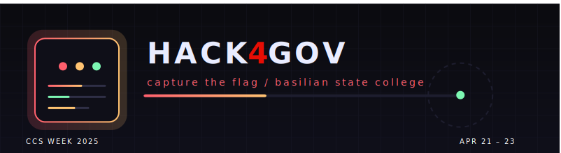

# Hack4Gov · CCS Week 2025

## What this is
- Flask app for the Hack4Gov CTF registration, confirmation, and admin dashboard.
- SQLite-backed; emails confirmation links; CSV export for admins.
- Animated neon UI for landing, participants list, and admin dashboard (with dark/light toggle).

## Quick start
1) Create a virtual env and install deps  
   `python -m venv .venv && .\.venv\Scripts\activate && pip install -r requirements.txt`
2) Set your secrets (env or direct edits before deploy)  
   - `app.secret_key` in `app.py`  
   - `ADMIN_USERNAME` / `ADMIN_PASSWORD`  
   - `EMAIL_SENDER` / `EMAIL_PASSWORD` (Gmail App Password)  
   - `BASE_URL` for production URL
3) Run the server  
   `python app.py`
4) Visit `http://localhost:5000` to register; `http://localhost:5000/admin` for the dashboard.

## Admin tips
- DB path: `hack4gov.db` (SQLite). WAL mode + busy timeout enabled to reduce locking.
- Export CSV at `Admin → [ export csv ]`.
- Light/dark toggle on the dashboard persists via localStorage.

## Responsive UI
- `templates/index.html` and `templates/participants.html` include mobile breakpoints (≤640px) for stacked layouts and touch-friendly controls.

## Banner reuse
- The animated SVG lives at `static/github-banner.svg` and is self-contained (no external assets). Use it in docs or GitHub profile with:  
  ``

## Deploy notes
- For production, run behind a WSGI server (e.g., gunicorn) and consider moving to Postgres/MySQL if write concurrency grows.

